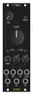

# Schräg

Schräg is an 8HP multimode filter module for the eurorack format, based off the [Bastl Cinnamon](https://bastl-instruments.com/eurorack/modules/cinnamon).

This is a rework of the original [Schräg](https://github.com/barnabywalters/Schraeg) by Barnaby Walters.

    

## Quick links

* [Schematic](pcb/schraeg.pdf)
* [Gerbers](gerbers/schraeg-gerbers-0.3.1.zip)
* [BOM](bom/schraeg_BOM.xlsx)
* [Schräg on ModularGrid](https://www.modulargrid.net/e/other-unknown-f1no5-schraeg)

## Features

Schräg is effectively a repackaged Bastl Cinnamon:

* Multimode filter with independent outputs (2-pole LP, 2-pole HP, 1-pole BP)
* V/oct input
* Self-resonates for use as a sine oscillator
* Input with an attenuator and 5x gain switch
* Two character switches for altering the resonance tracking
* All-SMD construction in a DIY-friendly format, with 0603 handsoldering footprints, all components on the back of the circuit board
* Built mostly using standard and easily-available components

with a few modifications:

* Larger 8HP form factor, allowing for a big juicy cutoff knob and larger character and gain switches
* Voltage control over resonance, through an attenuverter
* FM input through an attenuverter, which works as a pitch fine-tune control with nothing patched
* A bi-directional power connector, with polyfuses
* An Interactive BOM (`bom/schraeg_iBOM.html` once you’ve cloned the repo locally) to aid in part placement
* Schematics and PCB laid out using KiCAD

The additional functionality is achieved with a minimum of extra components, thanks to the two unused VCA cells in the original design.